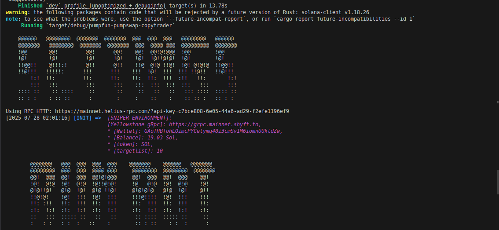

🚀 PumpSwap Copy Trading Bot in Rust
Error free, an optimized, high-performance copy trading bot for the Pump.fun Solana-based token exchange, built with ❤️ in Rust. This bot listens to traders’ activities in real-time and executes trades automatically based on your configurations.


---

## 📦 Features

- ⚡ Real-time copy trading via WebSocket
- 🧠 Automated decision-making logic
- 🔐 Secure key handling
- 🪙 Trade with Jito tips to maximize speed
- 🛠️ Fully customizable trader list and logic
- 📝 Easy configuration via `.env` file

---

## 🖥️ Preview



---

## 🔧 Setup Instructions

### 1. Clone the Repository

#### Run following command in terminal or cmd

```bash
git clone https://github.com/staindev/pumpswap-copy-trading-bot-rust.git
cd pumpswap-copy-trading-bot-rust
```

### 2. Configure .env

#### Edit and load enviroment varibales

```bash
PRIVATE_KEY=
PRIVATE_KEY=
RPC_HTTP=https://mainnet.helius-rpc.com/?api-key=8b9f842c-6823-4b62-b2ff-e2c65c9f1f59
RPC_WSS=wss://mainnet.helius-rpc.com/?api-key=8b9f842c-6823-4b62-b2ff-e2c65c9f1f59
YELLOWSTONE_GRPC_HTTP=https://grpc.mainnet.shyft.to
YELLOWSTONE_GRPC_TOKEN=82dcb08a-e218-4f2f-9fd7-7cfa7e47a18a
SLIPPAGE=0.5
JITO_BLOCK_ENGINE_URL=https://jito.mainnet.block-engine.jito.wtf
JITO_TIP_VALUE=0.0002
JITO_PRIORITY_FEE=0.00015
```

### 3. Copy wallets list

#### Add wallet addresses in targetlist.txt file

```bash
F3agfDYQBWkzU2o4cbdg3jz5kzALxX9Bak36cKvfV1E
5bo5sG4JaZUsGG4L46YBEengyFrLCm3VBhyj6GuBiBhf
2EAR5YdNp8RV8jJrELEMdc3buHNrHuRML3VV9oSibcTu
FGGMq3iA2uk5ZwCpRs6xhFpCZwy9vHDSkoykDxCDGyzV
```

### 4. Run project and enjoy journey

Run following command in terminal or cmd

```bash
cargo run
```

🤝 Contribution
PRs and forks are welcome!
If you have improvements or trading logic tweaks, feel free to contribute.

📜 License
This project is under the MIT License — see the LICENSE file for details.

🙋‍♂️ Author
Made with passion by @staindev
📧 staindev95@gmail.com
